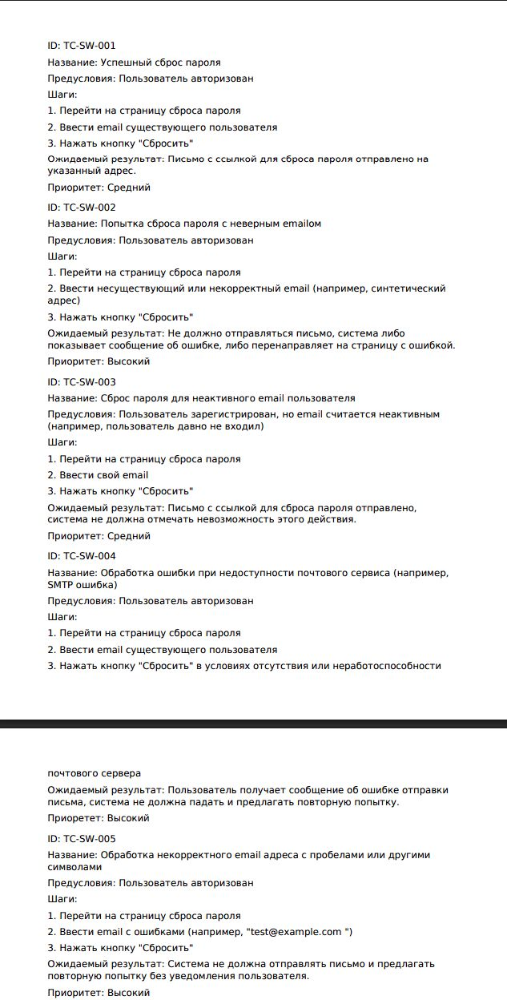

# 🤖 Авто-Генератор Тест-Кейсов Telegram-бот

Бот автоматически генерирует реальные тест-кейсы по описанию функционала и сохраняет их в `.xlsx` и `.pdf` форматах. Использует локальную LLM-модель через Ollama (`deepseek-r1:8b`).

## 🔧 Функциональность

- Генерация тест-кейсов на основе описания
- Структура: ID, Название, Предусловия, Шаги, Ожидаемый результат, Приоритет
- Экспорт в `.xlsx` и `.pdf`
- Автоматическая обработка кириллицы
- Удаление "мыслительного" блока `<think>...</think>` от модели
- Локальное сохранение кейсов в папку `keys/`

## 💬 Пример использования

> Отправляешь:  
> `Функционал сброса пароля через email`

> Получаешь:  
> 📊 Excel с тест-кейсами  
> 📑 PDF-отчёт (см. скриншот в `screenshots/`)
### 📄 PDF-отчёт


## 🧠 Используемое

- Python 3.11+
- [pyTelegramBotAPI](https://github.com/eternnoir/pyTelegramBotAPI)
- Ollama (`deepseek-r1:8b`)
- Pandas, ReportLab, Requests

## 🚀 Быстрый старт

1. Установи зависимости:

```bash
pip install -r requirements.txt
Запусти локально Ollama:

2. установи
ollama run deepseek-r1:8b

3.В config.py вставь свой Telegram BOT_TOKEN

BOT_TOKEN = '...'
OLLAMA_URL = 'http://localhost:11434/api/generate'
Запусти бота:

4. Запуск 
python bot.py


🗂 Папки
fonts/ — содержит DejaVuSans.ttf (нужен для PDF с кириллицей)
keys/ — автоматически сохраняются все отчёты
.
По желанию можете добавить разные шаблоны под ваши нужды
"""
🔧 Название: 🤖 Авто-Генератор Тест-Кейсов Telegram-бот 
👤 Автор: Metiso4kas
📅 Июнь 2025
💼 Назначение: Telegram бот для автоматического ии создания тест-кейсов
🛡 Лицензия: MIT

## 📜 Отказ от ответственности

- 🛠️ Данный проект создан исключительно для учебных и ознакомительных целей.
- 👤 Автор проекта не несёт ответственности за любые последствия использования этого инструмента.
- ❌ Коммерческое использование запрещена."

📢 Отказ от связи с Telegram

Данный проект является неофициальным и не аффилирован с Telegram.  
Telegram и логотип Telegram являются зарегистрированными товарными знаками их правообладателей.  
Проект использует открытое Telegram Bot API согласно [официальной документации](https://core.telegram.org/bots/api).
Он не является официальным продуктом Telegram Inc.

"""

